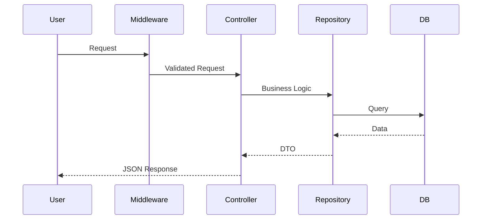

# Resource API

A robust, type-safe RESTful API built with Express, TypeScript, and Prisma.

## 🚀 Key Features
- **Clean Architecture:** Separated concerns into Controllers, Repositories, and Routes.
- **Robust Validation:** Request body/query validation using `Zod`.
- **Centralized Error Handling:** Global error management via `asyncHandler` middleware.
- **Scalable Design:** Ready for integration with any relational database via Prisma.
## 🌐 API Response Standardization
To ensure consistent responses across all endpoints, I implemented a custom `responseMiddleware`. 

- **`res.success(data)`**: Automatically wraps successful responses in a standard `{ success: true, data, meta }` envelope.
- **`res.error(message, status)`**: Ensures all errors follow a predictable `{ success: false, error, meta }` structure.

This eliminates repetitive boilerplate code in your controllers and guarantees that the client always receives a predictable JSON schema.

## 🏗️ Architecture


## 🛠️ Tech Stack
- **Runtime:** Node.js
- **Language:** TypeScript
- **Framework:** Express
- **ORM:** Prisma
- **Validation:** Zod


## 📋 Requirements
- **Node.js** (v20 or higher)
- **pnpm** (or npm/yarn if you prefer, though this project uses pnpm)
- **SQLite** (or your preferred database, as configured in `DATABASE_URL`)
- **Environment Variables:** - Create a `.env` file in the root directory.

## 🚀 How to Run
1. Install dependencies: `pnpm install` or `npm install`.
2. npm rebuild better-sqlite3 ( **Must use npm here** ).
2. Set up your `.env` file
`DATABASE_URL="file:./dev.db"`
`PORT=6000`
`NODE_ENV=development`
3. Run the development server: `npm run dev`

## 📡 API Endpoints

| Method | Endpoint | Description |
| :--- | :--- | :--- |
| `GET` | `/api/v1/resources` | Get all resources (supports `name` & `description` filters) |
| `POST` | `/api/v1/resources` | Create a new resource (requires validation) |
| `GET` | `/api/v1/resources/:id` | Get a specific resource by ID |
| `PUT` | `/api/v1/resources/:id` | Update an existing resource |
| `DELETE` | `/api/v1/resources/:id` | Delete a resource |


### 1. GET /api/v1/resources
- **Description:** Retrieve all resources.
- **Query Params:**
  - `name` (optional): Filter resources by name (e.g., `?name=example`).
  - `description` (optional): Filter resources by description (e.g., `?description=work`).

### 2. POST /api/v1/resources
- **Description:** Create a new resource.
- **Headers:** - 
  * ``Content-Type: application/json``
- **Payload Example:**
  ```json
  {
    "name": "Project Alpha",
    "description": "Initial planning phase"
  }

### 3. GET /api/v1/resources/:id
- **Description:** Retrieve detail of a resource.

### 4. PUT /api/v1/resources/:id
- **Description:** Update a resource.
- **Payload Example:**
  ```json
  {
    "name": "Project Alpha",
    "description": "Initial planning phase"
  }

### 5. DELETE /api/v1/resources/:id
- **Description:** Update a resource.

## 🧪 Testing with Postman
To test your API endpoints, follow these steps:

1. **Set the Content-Type:** - For `POST` and `PUT` requests, go to the **Headers** tab.
   - Add a key: `Content-Type` with the value: `application/json`.
   - *Alternatively, in the **Body** tab, select **"raw"** and choose **"JSON"** from the dropdown menu (this sets the header automatically).*

2. **Endpoints:** - Ensure the request URL matches your local server port (e.g., `http://localhost:3000/api/v1/resources`).

3. **Validation:** - If you send an invalid payload to a `POST` route, the API will return a `400 Bad Request` with details on the validation error, courtesy of `zod`.


    