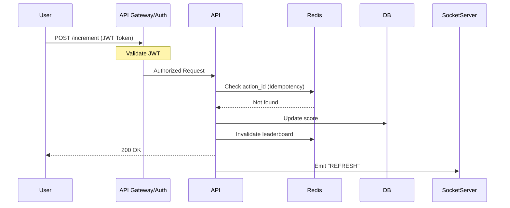

## 1. Request Lifecycle:
Every request to the POST /increment endpoint is processed through a deterministic security pipeline.



 ## 2. Persistence & Data Integrity
 ### 2.1 Database Schema
``` mermaid 
    erDiagram
    USERS ||--o{ ACTION_LOGS : "performs"
    USERS ||--|| SCORES : "has"
    
    USERS {
        int user_id PK
        string username
        string email
    }
    ACTION_LOGS {
        uuid action_id PK
        int user_id FK
        string action_type
        int score_earned
        timestamp created_at
    }
    SCORES {
        int user_id PK
        int total_score
        timestamp updated_at
    }
 ```

### 2.2 Atomic Transaction for increasing score
``` mermaid
sequenceDiagram
    title Request Pipeline: Atomic Transaction (POST)
    participant API
    participant DB as PostgreSQL
    
    API->>DB: BEGIN Transaction
    API->>DB: UPDATE SCORES (Increment)
    API->>DB: INSERT ACTION_LOGS (Log)
    
    alt Success
        API->>DB: COMMIT
        DB-->>API: 200 OK
    else Failure (Constraint/Error)
        API->>DB: ROLLBACK
        DB-->>API: 500 Error
    end
```

### 2.1 Architectural Rationale: Table Partitioning
To maximize concurrency and minimize lock contention, the user's score state is decoupled from the users profile table.
- **Isolation:** By separating SCORES from USERS, we ensure that database row-level locks occurring during score updates (e.g., SELECT ... FOR UPDATE) do not block read/write access to the USERS profile data.
- **Throughput:** This design allows profile updates (like changing an email) and score updates (like incrementing points) to proceed in parallel without waiting for the same row locks.
- **Atomic Scope:** Transactions are restricted to the SCORES and ACTION_LOGS tables, maintaining a smaller "lock footprint."


## 3. High-Performance Infrastructure
 ``` mermaid 

graph TD
    User((User)) -->|GET /leaderboard| API
    
    subgraph "High Performance Tier"
    API -->|Check| Redis[Redis ZSET Leaderboard]
    Redis -.->|Cache Miss| API
    end
    
    subgraph "Persistence Tier"
    API -->|Query| DB[(PostgreSQL)]
    DB -->|Fetch| API
    end
    
    API -->|Update Cache| Redis
    
 ```

 ### Recommended Technical Reading

- **AWS Documentation:** Database Caching Strategies (https://docs.aws.amazon.com/whitepapers/latest/database-caching-strategies-using-redis/caching-patterns.html) – This is the definitive guide on understanding when to use Cache-Aside vs. Write-Through. It is highly practical and perfect for architectural planning.
- **Caching Patterns:** (https://www.devopsness.com/blog/caching-patterns-read-write-through-cache-aside) Read-Through, Write-Through, Cache-Aside – A deep dive into the pros/cons of these patterns and how to handle common issues like cache stampedes.
- **Redis Official Tutorial:** (https://redis.io/tutorials/howtos/leaderboard/) Build a Real-Time Leaderboard – This is excellent. It walks you through exactly why ZSET is used, the Big-O complexity of the commands, and how to query rankings.
- **ByteByteGo:** (https://bytebytego.com/courses/system-design-interview/real-time-gaming-leaderboard) Real-time Gaming Leaderboard System Design – A high-level system design perspective on how to scale leaderboards for millions of users.

 ## 4. JWT Authentication & Validation Pipeline
 ```mermaid

sequenceDiagram
    autonumber
    participant Client
    participant AuthMiddleware as API Server (Auth Middleware)
    participant Redis
    participant DB as PostgreSQL

    Client->>AuthMiddleware: Protected Request (Bearer <token>)
    
    rect rgb(240, 248, 255)
        Note over AuthMiddleware: 1. Signature Verification
        AuthMiddleware->>AuthMiddleware: Validate Signature
        alt Invalid Signature
            AuthMiddleware-->>Client: 401 Unauthorized
        end
    end

    rect rgb(255, 245, 238)
        Note over AuthMiddleware, Redis: 2. Revocation Check
        AuthMiddleware->>Redis: Get jti (is blacklisted?)
        alt jti is Blacklisted
            AuthMiddleware-->>Client: 401 Unauthorized
        end
    end

    rect rgb(230, 255, 230)
        Note over AuthMiddleware, DB: 3. Session Validation
        AuthMiddleware->>DB: Get token_version (uid)
        AuthMiddleware->>AuthMiddleware: JWT.token_version < DB.token_version?
        alt Version Mismatch
            AuthMiddleware-->>Client: 401 Unauthorized
        end
    end

    AuthMiddleware->>AuthMiddleware: Proceed to Business Logic
    AuthMiddleware-->>Client: 200 OK

```

## Real-Time Communication
``` mermaid
sequenceDiagram
    autonumber
    participant Client
    participant LoadBalancer
    participant WebSocketServer
    participant RedisPubSub

    Note over Client, WebSocketServer: 1. Handshake Phase
    Client->>WebSocketServer: WS Connection Request (JWT Auth)
    WebSocketServer->>WebSocketServer: Validate JWT
    WebSocketServer-->>Client: 101 Switching Protocols

    Note over WebSocketServer, RedisPubSub: 2. Subscription Phase
    WebSocketServer->>RedisPubSub: Subscribe to 'leaderboard_updates'

    Note over Client, WebSocketServer: 3. Real-time Phase
    loop Heartbeat
        WebSocketServer->>Client: Ping
        Client-->>WebSocketServer: Pong
    end

    Note over RedisPubSub, WebSocketServer: 4. Event Broadcast
    RedisPubSub-->>WebSocketServer: New Score Event
    WebSocketServer-->>Client: Emit 'SCORE_UPDATE' (data)

    Note over Client, WebSocketServer: 5. Cleanup
    Client->>WebSocketServer: Close Connection
    WebSocketServer->>WebSocketServer: Unsubscribe from Topics

  ```

  
## Conclusion: Architectural Commitment
The architecture outlined in this document is designed to balance high-concurrency performance with strict data integrity. By decoupling the persistence and caching layers and enforcing atomic transaction boundaries, we have created a resilient system capable of scaling alongside our user base. This document serves as the foundation for future development—any proposed changes must be evaluated against these performance and consistency requirements.
