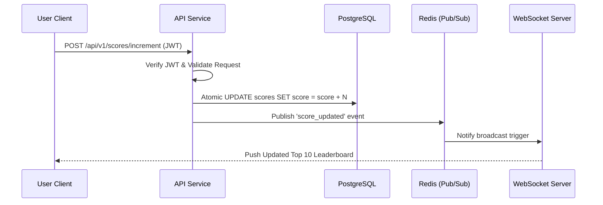
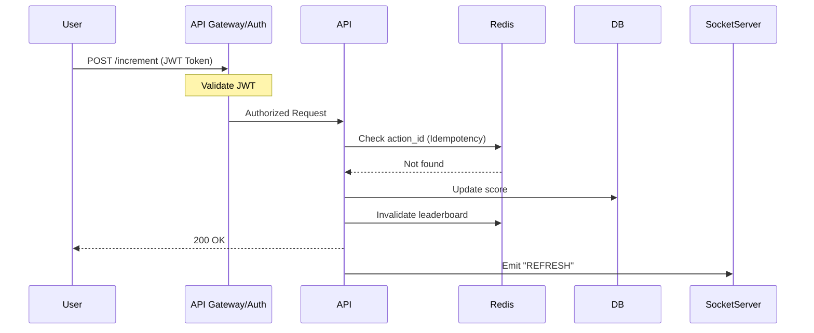

### Problem 6: Architecture

## 1. Project Objective
This service manages a real-time leaderboard for our website. The core objectives are:
- **Real-time Synchronization:** Update the Top 10 leaderboard live as user scores change.
- **Score Persistence:** Process completed user actions to increment scores reliably.
- **Security:** Ensure all score updates are authorized and protected against malicious tampering.

## 2. System Requirements
1. **Live Updates:** Maintain a live-updating Top 10 leaderboard.
2. **Score Processing:** Expose an API endpoint to increment scores upon action completion.
3. **Security:** Implement strict authorization to prevent unauthorized score manipulation.
---

## 3. Technology Stack
This service is built for high-concurrency and real-time responsiveness.

| Layer | Technology | Purpose |
| :--- | :--- | :--- |
| **Runtime** | Node.js (TypeScript) | Strong typing and non-blocking I/O |
| **API Framework** | Express | Modular, lightweight routing |
| **Real-time** | Socket.io | Bi-directional event-based broadcasting |
| **Database** | PostgreSQL | ACID compliance for atomic score updates |
| **Caching/Pub-Sub** | Redis | High-speed leaderboard and event broadcasting |
| **Validation** | Zod | Runtime schema enforcement |

## 4. Architecture Overview




## 5. Tables

**5.1** **Users Table**

``` sql 

CREATE TABLE users (

    user_id SERIAL PRIMARY KEY,

    username VARCHAR(50) UNIQUE NOT NULL,

    email VARCHAR(255) UNIQUE NOT NULL,

    created_at TIMESTAMP DEFAULT CURRENT_TIMESTAMP

);

```


**5.2 Scores Table**

``` sql 
CREATE TABLE scores (

    user_id INTEGER PRIMARY KEY REFERENCES users(user_id),

    total_score BIGINT DEFAULT 0,

    updated_at TIMESTAMP DEFAULT CURRENT_TIMESTAMP

);

```


**5.3 Audit Log (For Idempotency & History)**
``` sql
CREATE TABLE action_logs (

    action_id UUID PRIMARY KEY,

    user_id INTEGER REFERENCES users(user_id),

    increment_value INTEGER NOT NULL,

    processed_at TIMESTAMP DEFAULT CURRENT_TIMESTAMP

); 
```

### 5.4 Action Types
**Please use this Object for checking score**
``` js
 const ACTION_SCORES = {
  'LEVEL_COMPLETE': 500,
  'DAILY_BONUS': 100,
  'SOCIAL_SHARE': 50,
  'TUTORIAL_FINISH': 200
};
```

## 6. Performance & Caching
To ensure high responsiveness under load, the system utilizes Redis to offload read-heavy operations:

* **Leaderboard Data:** Cached using Redis **Sorted Sets (ZSET)**. This allows for $O(\log N)$ retrieval of top-ranked users, keeping the leaderboard performant regardless of user count.
* **User Scores:** Individual scores are cached with a short TTL (60s) to minimize direct database hits.
* **Data Consistency:** The database remains the final source of truth; Redis acts purely as a performance optimization layer.

## 7.1. Authentication & Session Management Specification
The system uses JSON Web Tokens (JWT) for stateless, scalable authentication. To ensure security, the implementation includes a robust token lifecycle:

-   **Token Issuance:** Upon login, the client receives an access token (short-lived) and an optional refresh token.
-   **Token Versioning:** Each user has a token_version stored in the database. Every request validates the token's version against the database, allowing for immediate "Logout All Sessions" functionality if a user's account is compromised.
-   **Revocation List:** A Redis-backed blacklist is used to immediately invalidate individual jti (JWT ID) claims, ensuring that access can be revoked before the token naturally expires.


## 8.  End points
### 8.1. ``GET`` /api/v1/leaderboards
- **Description:** Retrieve the current Top 10 users' scores..
- **Method:** ``GET``
- **Headers:**
  -**Authorization:** ``Bearer <JWT_TOKEN>`` **(Optional)**
- **Query Parameters:**

  * **`limit`** *(Optional, Integer)*: The number of records to return.
       * **Default:** `10`
       * **Maximum:** `100`
       * **Explanation:** Restricts the result set size to optimize performance and prevent excessive payload sizes.

  * **`offset`** *(Optional, Integer)*: The number of records to skip.
    * **Default:** `0`
    * **Explanation:** Enables pagination by allowing the client to request subsequent pages of data.
- **Success Response** (200 OK)
  ```json{
  "status": "success",
  "data": {
    "leaderboard": [
      { "rank": 1,"user_id": 77, "username": "PlayerOne", "score": 1500 },
      { "rank": 2,"user_id":7 ,"username": "PlayerTwo", "score": 1450 }
    ]
  }
}


### 8.2. ``POST`` /api/v1/scores/increment
- **Description:** Atomically increments the user's score in the primary database and triggers a real-time leaderboard update
- **Method:** ``POST``
- **Headers:** - **Authorization:** 
  *  ``Bearer <JWT_TOKEN>`` 
  * ``Content-Type: application/json``
- **Payload:**
  ```json{
  "action_id": "string",
  "action_type": "LEVEL_COMPLETE"
}
- **Success Response** (200 OK):
  ```json{
  "status": "success",
  "message": "Score updated successfully",
  "new_score": 1510
}
- **Error Responses:**
  * **``401`` Unauthorized**: Token is missing or invalid.
Used to securely increment a user's score upon action completion.
  * **``400`` Bad Request:** increment_value must be a positive integer.
  * **``429 (Rate Limit):** Rate limit exceeded
  * **``500`` Internal Server Error:** Database or Cache service failure.

### 8.3. ``GET`` /api/v1/user/:user_id
- **Description:** Retrieve user detail..
- **Method:** ``GET``
- **Headers:**
  -**Authorization:** ``Bearer <JWT_TOKEN>``
- **Query Parameters:** None
- **Success Response** (200 OK)
  ```json{
  "status": "success",
  {
    "data": {
      "user_id": 132,
      "user_name": "Data Guy",
      "email": "dataguy@gmail.com",
      "created_at": "2026-06-21T12:56:11Z"
    }
  }
- **Error Response (404 Not Found):**
  ```json{
  "status": "error",
  "message": "User not found"
}

## Request Lifecycle:
Every request to the POST /increment endpoint is processed through a deterministic security pipeline. Requests that fail any of these gates are rejected immediately with the appropriate HTTP status code (401 for unauthorized, 429 for rate-limited, 403 for blocked actions).



``` mermaid 
    erDiagram
    USERS ||--o{ ACTION_LOGS : "performs"
    USERS ||--|| SCORES : "has"
    
    USERS {
        int user_id PK
        string username
        string email
    }
    ACTION_LOGS {
        uuid action_id PK
        int user_id FK
        string action_type
        int score_earned
        timestamp created_at
    }
    SCORES {
        int user_id PK
        int total_score
        timestamp updated_at
    }
 ```

 ``` mermaid 

graph TD
    User((User)) -->|GET /leaderboard| API
    
    subgraph "High Performance Tier"
    API -->|Check| Redis[Redis ZSET Leaderboard]
    Redis -.->|Cache Miss| API
    end
    
    subgraph "Persistence Tier"
    API -->|Query| DB[(PostgreSQL)]
    DB -->|Fetch| API
    end
    
    API -->|Update Cache| Redis
    
    style Redis fill:#f9f,stroke:#333,stroke-width:2px
    style DB fill:#e1f5fe,stroke:#333,stroke-width:2px
 ```

 
 ```mermaid

sequenceDiagram
    autonumber
    participant Client
    participant AuthMiddleware as API Server (Auth Middleware)
    participant Redis
    participant DB as PostgreSQL

    Client->>AuthMiddleware: Protected Request (Bearer <token>)
    
    rect rgb(240, 248, 255)
        Note over AuthMiddleware: 1. Signature Verification
        AuthMiddleware->>AuthMiddleware: Validate Signature
        alt Invalid Signature
            AuthMiddleware-->>Client: 401 Unauthorized
        end
    end

    rect rgb(255, 245, 238)
        Note over AuthMiddleware, Redis: 2. Revocation Check
        AuthMiddleware->>Redis: Get jti (is blacklisted?)
        alt jti is Blacklisted
            AuthMiddleware-->>Client: 401 Unauthorized
        end
    end

    rect rgb(230, 255, 230)
        Note over AuthMiddleware, DB: 3. Session Validation
        AuthMiddleware->>DB: Get token_version (uid)
        AuthMiddleware->>AuthMiddleware: JWT.token_version < DB.token_version?
        alt Version Mismatch
            AuthMiddleware-->>Client: 401 Unauthorized
        end
    end

    AuthMiddleware->>AuthMiddleware: Proceed to Business Logic
    AuthMiddleware-->>Client: 200 OK

```
``` mermaid
sequenceDiagram
    autonumber
    participant Client
    participant LoadBalancer
    participant WebSocketServer
    participant RedisPubSub

    Note over Client, WebSocketServer: 1. Handshake Phase
    Client->>WebSocketServer: WS Connection Request (JWT Auth)
    WebSocketServer->>WebSocketServer: Validate JWT
    WebSocketServer-->>Client: 101 Switching Protocols

    Note over WebSocketServer, RedisPubSub: 2. Subscription Phase
    WebSocketServer->>RedisPubSub: Subscribe to 'leaderboard_updates'

    Note over Client, WebSocketServer: 3. Real-time Phase
    loop Heartbeat
        WebSocketServer->>Client: Ping
        Client-->>WebSocketServer: Pong
    end

    Note over RedisPubSub, WebSocketServer: 4. Event Broadcast
    RedisPubSub-->>WebSocketServer: New Score Event
    WebSocketServer-->>Client: Emit 'SCORE_UPDATE' (data)

    Note over Client, WebSocketServer: 5. Cleanup
    Client->>WebSocketServer: Close Connection
    WebSocketServer->>WebSocketServer: Unsubscribe from Topics

  ```


## 📚 Documentation
- [Architecture & Flow](./ARCHITECTURE.md)
- [Future Improvements](./IMPROVEMENTS.md)

